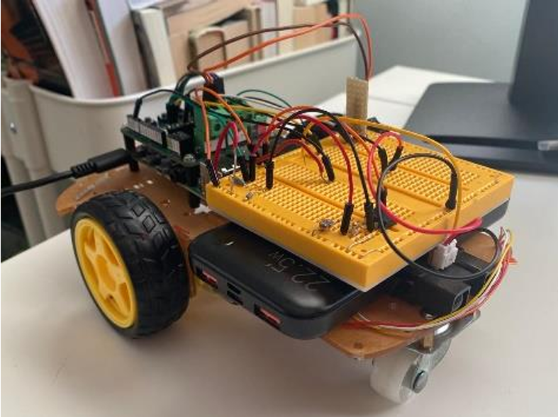
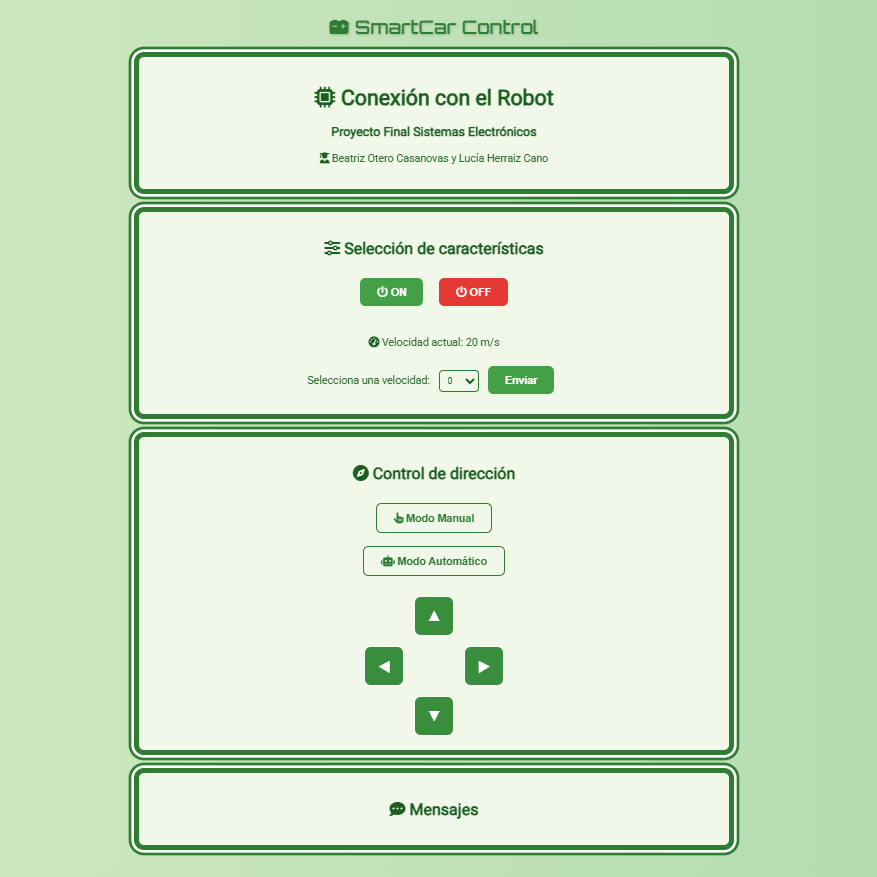

# 📌 Electronic Systems 
 

## 📖 Introduction  

This repository contains the code for an autonomous robot designed to monitor and control environmental conditions such as humidity, CO₂ levels, temperature, and more. 

It is intended for use in environments like food production facilities, greenhouses, or storage units, where maintaining optimal conditions is crucial.


<div align="center">

</div>

---  

## 📂 Contents  
1. [🌍] [General Description](#general-description)  
2. [⚙️] [Installation and Execution](#installation-and-execution)  
3. [📊] [Module Distribution](#module-distribution)
4. [🙍🏼‍♀️] [Contributors](#contributors)
5. [📄] [License](#license)


---  

## 🌍 <span id="general-description">General Description </span>  

The robot's main purpose is to monitor and control environmental conditions such as humidity, CO₂ levels, temperature, and more. 

The robot can operate in either autonomous or manual mode. Its movement mode, speed, and power state (on/off) can all be controlled remotely through a web interface.

<div align="center">

</div>

All the environmental data collected by the robot is stored in an SQL database, where it can later be accessed and analyzed.

---  

## ⚙️ <span id="installation-and-execution">Installation and Execution</span>

### 🚀 Prerequisites  

**Required software:**  
- Visual Studio Code (optional but recommended).  
- Git installed and configured.  
- Python.  
- Raspberry Pi Environment

**Specific dependencies:** Check the *requirements.txt* file to install the necessary packages.  

**Access paths:** Access paths and other parameters can be configured in the *config/configuracion.ini* file.  

### 🔧 Installation Steps  

```bash
# Clone the repository
git clone

# Install dependencies
pip install -r requirements.txt  

# Run the project
python main.py  

```
---

## 📖 <span id="module-distribution">Module Distribution</span>

The project is divided in the following modules:

- app: Module that contains the code of the web server
- config: Module that contaisn all the configuration files
- core: Main module that contains the robot control code
- server2: Module that contains the code of the Database server

---

## 🙍🏼‍♀️ <span id="contributors">Contributors</span>

- <a href="https://github.com/LuciaHC" target="_blank">Lucía Herraiz</a>
- <a href="https://github.com/beaotero" target="_blank">Beatriz Otero</a>

---

## 📄 <span id="license">License</span>

[](https://opensource.org/licenses/MIT)
